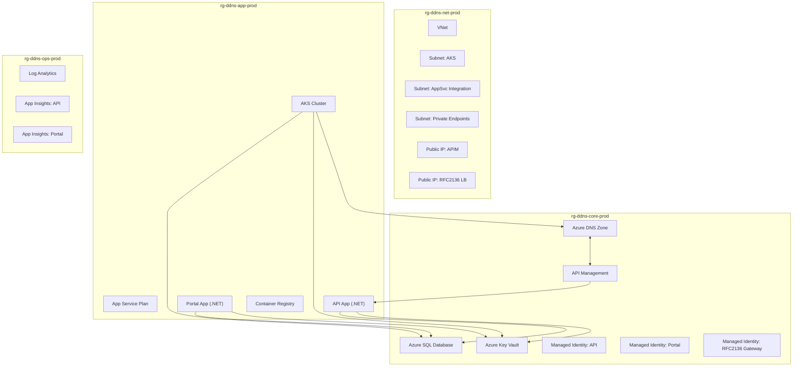

# BICEP Module Breakdown by Copilot
## High‑Level Bicep Structure
```bash
/infra
  /core
    dns.bicep
    sql.bicep
    keyvault.bicep
    identities.bicep
  /network
    vnet.bicep
    subnets.bicep
    privateEndpoints.bicep
    publicIps.bicep
  /aks
    aksCluster.bicep
    aksNodePools.bicep
    aksAddons.bicep
  /app
    appServicePlan.bicep
    apiApp.bicep
    portalApp.bicep
    apim.bicep
  /monitoring
    logAnalytics.bicep
    appInsights.bicep
    alerts.bicep
main.bicep
```

# Mermaid Diagram - Resource Topology



## Bicep Module Breakdown

### 1 `main.bicep`
```bash
module core './core/core.bicep' = {
  name: 'core'
  params: { ... }
}

module network './network/network.bicep' = {
  name: 'network'
  params: { ... }
}

module aks './aks/aksCluster.bicep' = {
  name: 'aks'
  params: {
    vnetId: network.outputs.vnetId
    subnetId: network.outputs.aksSubnetId
    miId: core.outputs.miRfcId
  }
}

module app './app/app.bicep' = {
  name: 'app'
  params: {
    miApiId: core.outputs.miApiId
    miPortalId: core.outputs.miPortalId
    sqlConnectionString: core.outputs.sqlConnectionString
  }
}

module monitoring './monitoring/monitoring.bicep' = {
  name: 'monitoring'
  params: { ... }
}
```

### 2. Core Modules
`core/dns.bicep`

Creates the public DNS zone:

```bicep
resource dnsZone 'Microsoft.Network/dnsZones@2023-07-01' = {
  name: 'ddns.yourcompany.com'
  location: 'global'
}
```
Outputs:
- dnsZoneId
- nameServers


`core/sql.bicep`

Creates SQL server + DB + (optionally) AAD admin.

Example:

```bicep
resource sqlServer 'Microsoft.Sql/servers@2022-05-01-preview' = {
  name: 'ddnssql-prod'
  location: location
  properties: {
    administratorLogin: 'sqladmin'
    administratorLoginPassword: sqlPassword
  }
}

resource sqlDb 'Microsoft.Sql/servers/databases@2022-05-01-preview' = {
  name: '${sqlServer.name}/ddns-config-db'
  sku: {
    name: 'GP_Gen5_2'
  }
}
```
Outputs:
- sqlServerName
- sqlDbName
- sqlConnectionString

`core/keyvault.bicep`
Stores:
- TSIG keys
- API keys
- Signing keys

Example:
```bicep
resource kv 'Microsoft.KeyVault/vaults@2023-02-01' = {
  name: 'kv-ddns-prod'
  location: location
  properties: {
    tenantId: tenantId
    sku: { family: 'A'; name: 'standard' }
    accessPolicies: []
  }
}
```
Outputs:
- keyVaultUri

`core/identities.bicep`

Creates user‑assigned managed identities:

```bicep
resource miApi 'Microsoft.ManagedIdentity/userAssignedIdentities@2023-01-31' = {
  name: 'mi-ddns-api'
  location: location
}

resource miPortal 'Microsoft.ManagedIdentity/userAssignedIdentities@2023-01-31' = {
  name: 'mi-ddns-portal'
  location: location
}

resource miRfc 'Microsoft.ManagedIdentity/userAssignedIdentities@2023-01-31' = {
  name: 'mi-ddns-rfc2136'
  location: location
}
```

Outputs:
- miApiId
- miPortalId
- miRfcId

### 3. Network modules
`network/vnet.bicep`

Creates the VNet:

```bicep
resource vnet 'Microsoft.Network/virtualNetworks@2023-04-01' = {
  name: 'vnet-ddns-prod'
  location: location
  properties: {
    addressSpace: {
      addressPrefixes: [
        '10.10.0.0/16'
      ]
    }
  }
}
```

`network/subnets.bicep`
Creates:
- snet-aks
- snet-appsvc-integration
- snet-private-endpoints

Example:

```bicep
resource aksSubnet 'Microsoft.Network/virtualNetworks/subnets@2023-04-01' = {
  name: '${vnet.name}/snet-aks'
  properties: {
    addressPrefix: '10.10.1.0/24'
  }
}

resource appSubnet 'Microsoft.Network/virtualNetworks/subnets@2023-04-01' = {
  name: '${vnet.name}/snet-appsvc-integration'
  properties: {
    addressPrefix: '10.10.2.0/24'
    delegations: [
      {
        name: 'delegation'
        properties: {
          serviceName: 'Microsoft.Web/serverFarms'
        }
      }
    ]
  }
}

resource peSubnet 'Microsoft.Network/virtualNetworks/subnets@2023-04-01' = {
  name: '${vnet.name}/snet-private-endpoints'
  properties: {
    addressPrefix: '10.10.3.0/24'
  }
}
```

Outputs:
- aksSubnetId
- appSubnetId
- peSubnetId
- vnetId

---
`network/privateEndpoints.bicep`

Creates private endpoints for:
- SQL
- Key Vault

(Specific Microsoft.Network/privateEndpoints resources pointing to SQL and KV.)

---
`network/publicIps.bicep`
Creates:

```bicep
resource pipRfc 'Microsoft.Network/publicIPAddresses@2023-04-01' = {
  name: 'pip-ddns-rfc2136-prod'
  location: location
  sku: { name: 'Standard' }
  properties: {
    publicIPAllocationMethod: 'Static'
  }
}

resource pipApim 'Microsoft.Network/publicIPAddresses@2023-04-01' = {
  name: 'pip-ddns-apim-prod'
  location: location
  sku: { name: 'Standard' }
  properties: {
    publicIPAllocationMethod: 'Static'
  }
}
```

Outputs:
- pipRfcId
- pipApimId

---
## 4. AKS modules
`aks/aksCluster.bicep`

Creates AKS with Azure CNI, OIDC issuer, workload identity:

```bicep
resource aks 'Microsoft.ContainerService/managedClusters@2023-07-01' = {
  name: 'aks-ddns-prod'
  location: location
  identity: {
    type: 'SystemAssigned'
  }
  properties: {
    dnsPrefix: 'ddns-aks'
    networkProfile: {
      networkPlugin: 'azure'
      serviceCidr: '10.20.0.0/16'
      dnsServiceIp: '10.20.0.10'
      dockerBridgeCidr: '172.17.0.1/16'
    }
    oidcIssuerProfile: {
      enabled: true
    }
  }
}
```

`aks/aksNodePools.bicep`
Defines:
- System node pool
- User node pool

(e.g., Microsoft.ContainerService/managedClusters/agentPools resources.)

---
`aks/aksAddons.bicep`
Enables:
- Container Insights
- CSI Secret Store
- AAD integration

(Depending on add‑on configuration style for your AKS version.)

---
## 5. App Service modules
`app/appServicePlan.bicep`

Creates Linux Premium plan:

```bicep
resource asp 'Microsoft.Web/serverfarms@2022-09-01' = {
  name: 'asp-ddns-prod'
  location: location
  sku: {
    name: 'P1v3'
    tier: 'PremiumV3'
    capacity: 1
  }
  kind: 'linux'
  properties: {
    reserved: true
  }
}
```

`app/apiApp.bicep`

Deploys .NET API with managed identity, VNet integration, Key Vault references, app settings.

Key aspects:
- Microsoft.Web/sites with:
  - identity referencing mi-ddns-api
  - virtualNetworkSubnetId for integration
  - connection string to SQL
  - KEYVAULT_URI, DNS_ZONE_NAME, etc.

---
`app/portalApp.bicep`

Deploys .NET portal with:
- Managed identity (mi-ddns-portal)
- VNet integration
- AAD auth (configured via app settings or post‑deploy script)

`app/apim.bicep`

Creates APIM + APIs:
- ddns-public-api
- ddns-marketplace-fulfillment

Includes policies:
- JWT validation
- API key validation
- Rate limiting

Outputs:
- apimHostname
- apimGatewayUrl

---
## 6. Monitoring modules
`monitoring/logAnalytics.bicep`

Creates Log Analytics workspace:

```bicep
resource law 'Microsoft.OperationalInsights/workspaces@2022-10-01' = {
  name: 'law-ddns-prod'
  location: location
  properties: {
    retentionInDays: 30
  }
}
```
Outputs:
- lawId

---
`monitoring/appInsights.bicep`

Creates:
- API App Insights
- Portal App Insights

(e.g., two Microsoft.Insights/components resources.)

Outputs:
- apiAppInsightsInstrumentationKey
- portalAppInsightsInstrumentationKey

---
`monitoring/alerts.bicep`

Creates alerts for:
- AKS health
- API 5xx
- SQL CPU/storage
- APIM errors

(Using Microsoft.Insights/metricAlerts or scheduledQueryRules.)