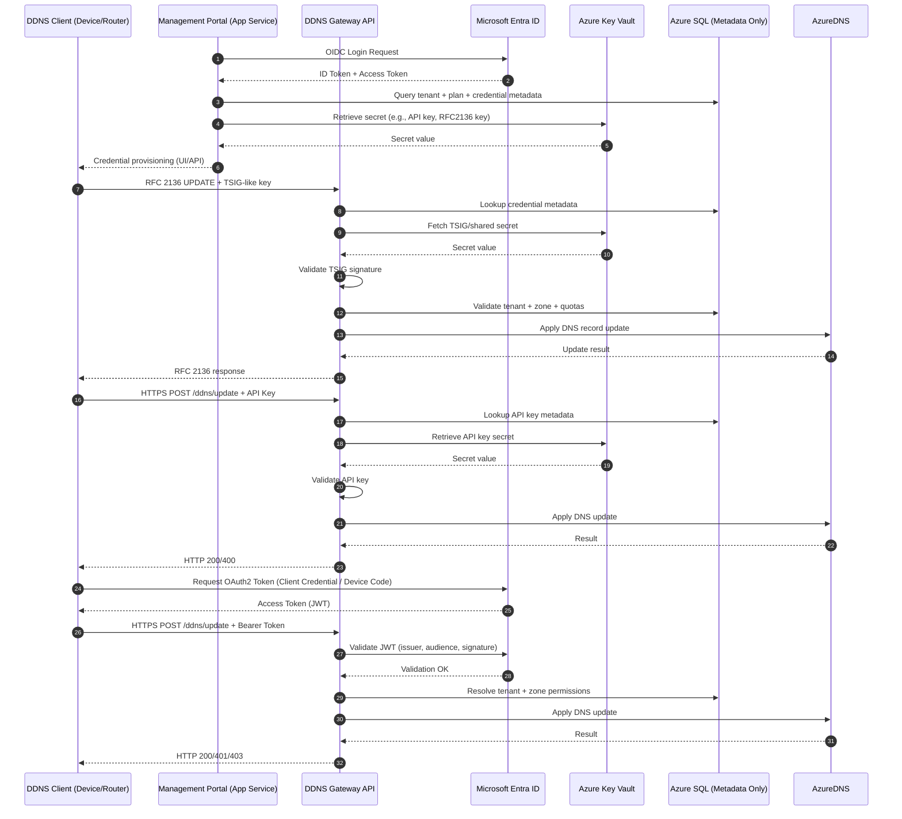

# DDNS System Authentication

## What This Diagram Shows
- Multi‑path authentication: RFC 2136, API keys, and Azure‑auth coexist cleanly.
- Key Vault as the single source of truth: Secrets never live in SQL or code.
- Portal-driven credential provisioning: Users authenticate via Entra ID, then generate keys.
- Gateway as the enforcement point: All auth, quotas, and tenant checks happen here.
- Azure DNS as the authoritative backend: Gateway translates updates into Azure DNS operations.