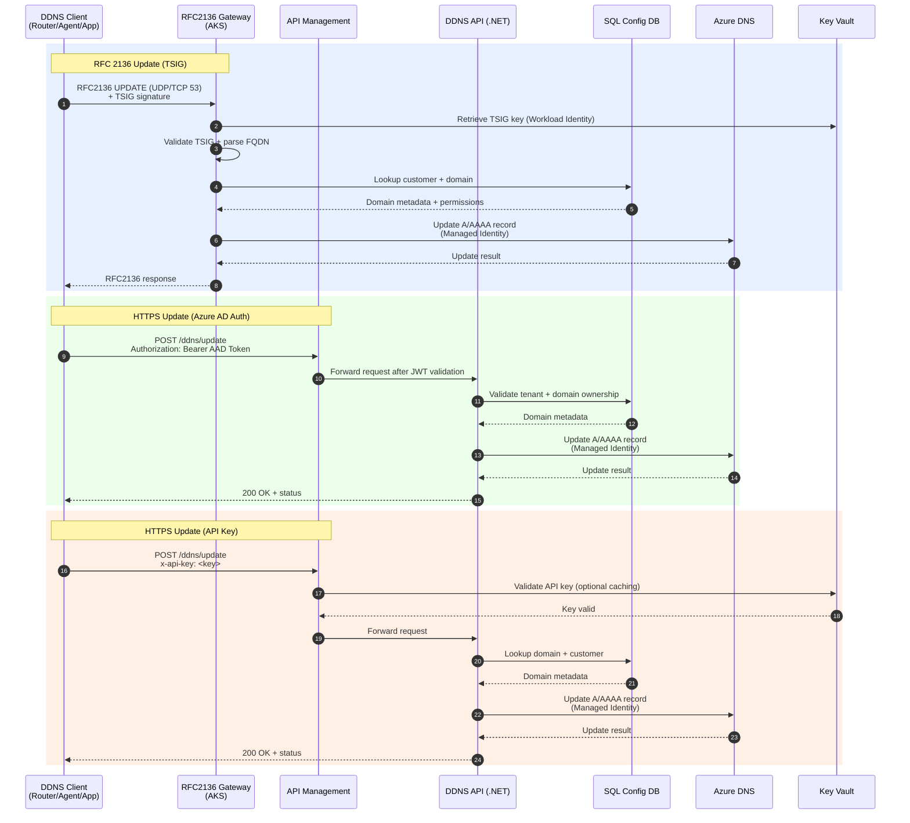

# DDNS Update Flow

```mermaid
sequenceDiagram
    autonumber

    participant Client as DDNS Client<br/>(Router/Agent/App)
    participant RFCGW as RFC2136 Gateway<br/>(AKS)
    participant APIM as API Management
    participant API as DDNS API (.NET)
    participant SQL as SQL Config DB
    participant DNS as Azure DNS
    participant KV as Key Vault

    %% --- RFC 2136 UPDATE FLOW ---
    rect rgb(230,240,255)
    Note over Client,RFCGW: RFC 2136 Update (TSIG)
    Client->>RFCGW: RFC2136 UPDATE (UDP/TCP 53)<br/>+ TSIG signature
    RFCGW->>KV: Retrieve TSIG key (Workload Identity)
    RFCGW->>RFCGW: Validate TSIG + parse FQDN
    RFCGW->>SQL: Lookup customer + domain
    SQL-->>RFCGW: Domain metadata + permissions
    RFCGW->>DNS: Update A/AAAA record<br/>(Managed Identity)
    DNS-->>RFCGW: Update result
    RFCGW-->>Client: RFC2136 response
    end

    %% --- HTTPS UPDATE WITH AZURE AD ---
    rect rgb(235,255,235)
    Note over Client,APIM: HTTPS Update (Azure AD Auth)
    Client->>APIM: POST /ddns/update<br/>Authorization: Bearer AAD Token
    APIM->>API: Forward request after JWT validation
    API->>SQL: Validate tenant + domain ownership
    SQL-->>API: Domain metadata
    API->>DNS: Update A/AAAA record<br/>(Managed Identity)
    DNS-->>API: Update result
    API-->>Client: 200 OK + status
    end

    %% --- HTTPS UPDATE WITH API KEY ---
    rect rgb(255,240,230)
    Note over Client,APIM: HTTPS Update (API Key)
    Client->>APIM: POST /ddns/update<br/>x-api-key: <key>
    APIM->>KV: Validate API key (optional caching)
    KV-->>APIM: Key valid
    APIM->>API: Forward request
    API->>SQL: Lookup domain + customer
    SQL-->>API: Domain metadata
    API->>DNS: Update A/AAAA record<br/>(Managed Identity)
    DNS-->>API: Update result
    API-->>Client: 200 OK + status
    end

```