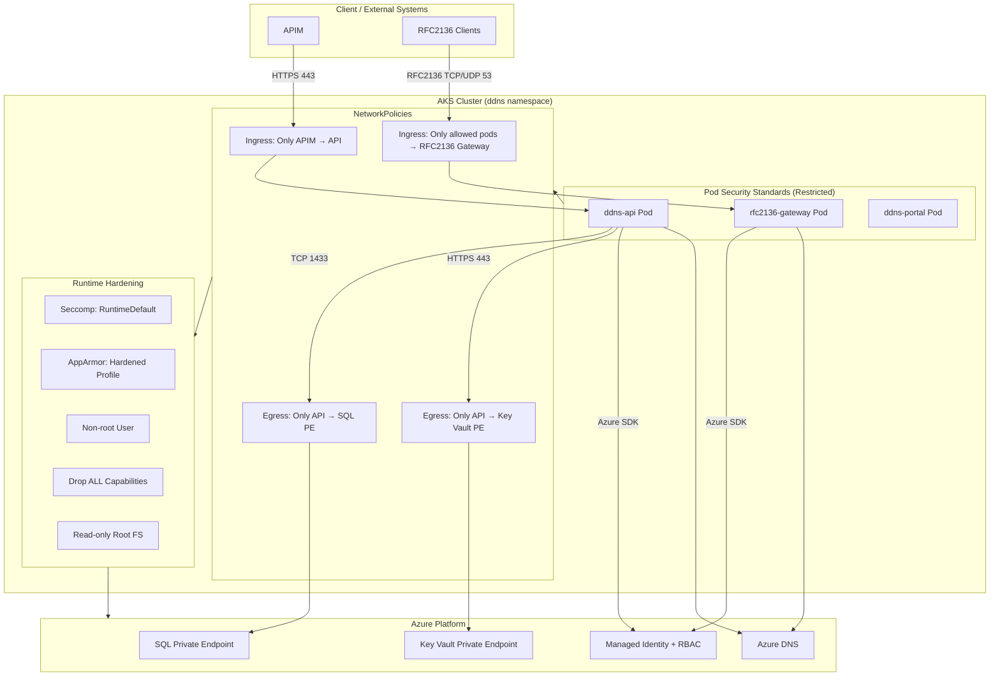

Mermaid Diagram — Enforcement Layers for AKS Security

Below is a pure Markdown, clean Mermaid diagram that visualizes the enforcement layers protecting your AKS‑based DDNS platform:
- Pod Security Standards (PSS)
- NetworkPolicies
- Azure Private Endpoints
- Managed Identity + RBAC
- AppArmor/Seccomp
- Namespace isolation

It’s designed to be readable, accurate, and ready to paste into documentation.

## What This Diagram Shows
1. Pod Security Standards (Restricted)
- Non‑root
- No privilege escalation
- Drop all capabilities
- Seccomp + AppArmor
- Read‑only root filesystem
2. NetworkPolicies
- Only APIM can reach the API
- API can only reach SQL + Key Vault
- Only labeled pods can reach the RFC2136 gateway
- Everything else is denied
3. Runtime Hardening
- Seccomp: RuntimeDefault
- AppArmor: hardened profile
- No Linux capabilities
- Immutable filesystem
4. Azure Enforcement
- SQL + Key Vault only reachable via Private Endpoints
- DNS updates require Managed Identity
- RBAC controls all Azure operations