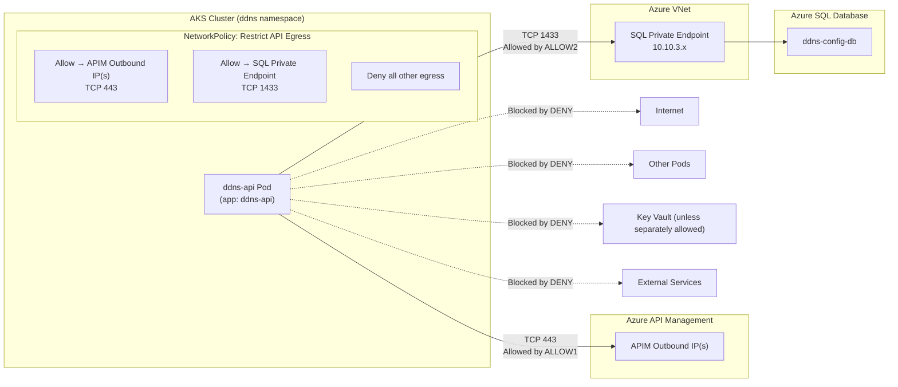

# Mermaid Diagram — Traffic Flow With Egress Policy Enabled

Here’s a pure Markdown, clean Mermaid diagram that shows the full traffic flow with the “API egress restricted to only APIM + SQL” NetworkPolicy enabled.
It visualizes what is allowed, what is blocked, and how the SQL Private Endpoint and APIM outbound IPs fit into the picture.

Mermaid Diagram — Traffic Flow With Egress Policy Enabled

## What This Diagram Shows
Allowed traffic
- API → APIM outbound IPs on TCP 443 
(for callbacks, token validation, or APIM‑initiated flows)
- API → SQL Private Endpoint on TCP 1433 
(for database access)

Blocked traffic
- Any egress to the public internet
- Any egress to other pods
- Any egress to Key Vault unless a separate policy allows it
- Any egress to external services
- Any egress to non‑SQL private endpoints

This is exactly how the NetworkPolicy enforces zero‑trust egress for your API.