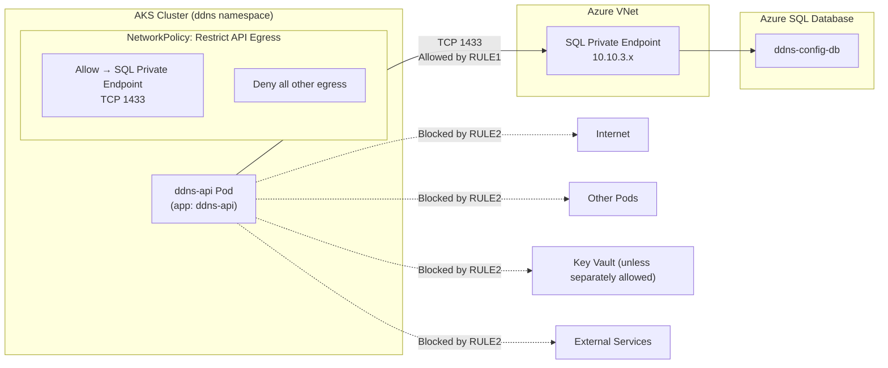

# Mermaid Diagram — API → SQL Traffic Flow (NetworkPolicy Enforced)

Below is a pure Markdown, clean Mermaid diagram that illustrates the API → SQL traffic flow with the NetworkPolicy restrictions enabled.

It shows exactly what is allowed, what is blocked, and how the SQL Private Endpoint fits into the path.

Mermaid Diagram — API → SQL Traffic Flow (NetworkPolicy Enforced)

### What This Diagram Shows
Allowed:
- The API pod can reach only the SQL Private Endpoint on TCP 1433.
- SQL Private Endpoint forwards traffic to Azure SQL Database.

Blocked:
- Any egress to the public internet
- Any egress to other pods
- Any egress to Key Vault (unless a separate policy allows it)
- Any egress to arbitrary external services

This is the exact behavior enforced by the NetworkPolicy you defined.