# A combined diagram of all NetworkPolicies

Here’s a pure Markdown, clean Mermaid diagram that combines all NetworkPolicies in your DDNS platform into a single, coherent view.
It shows ingress + egress, allowed + denied paths, and how each policy shapes traffic between APIM, API, SQL, Key Vault, and the RFC2136 Gateway.

This gives you a full zero‑trust traffic map for the AKS ddns namespace.

Mermaid Diagram — Combined NetworkPolicies for the DDNS Platform

```mermaid
flowchart LR

    %% ---------------------------
    %% External Systems
    %% ---------------------------
    subgraph External["External Systems"]
        APIM["APIM<br/>Outbound IPs"]
        RFC2136Clients["RFC2136 Clients"]
    end

    %% ---------------------------
    %% AKS Namespace
    %% ---------------------------
    subgraph AKS["AKS Cluster (ddns namespace)"]

        %% API Pod
        API["ddns-api Pod"]

        %% RFC2136 Gateway Pod
        GW["rfc2136-gateway Pod"]

        %% NetworkPolicies
        subgraph NP["NetworkPolicies"]

            %% Ingress Policies
            NP1["Ingress: Only APIM → API<br/>TCP 80/443"]
            NP2["Ingress: Only labeled pods → RFC2136 Gateway<br/>TCP/UDP 53"]

            %% Egress Policies
            NP3["Egress: API → SQL Private Endpoint<br/>TCP 1433"]
            NP4["Egress: API → APIM Outbound IPs<br/>TCP 443"]
            NP5["Egress: API → Key Vault PE (optional)<br/>TCP 443"]
            NP6["Default deny egress (API)"]

        end
    end

    %% ---------------------------
    %% Azure Services
    %% ---------------------------
    subgraph Azure["Azure Platform"]
        SQLPE["SQL Private Endpoint<br/>10.10.3.x"]
        KVPE["Key Vault Private Endpoint<br/>10.10.3.y"]
        SQLDB["Azure SQL Database"]
        KV["Azure Key Vault"]
    end

    %% ---------------------------
    %% Allowed Ingress Paths
    %% ---------------------------
    APIM -->|Allowed by NP1<br/>TCP 80/443| API
    RFC2136Clients -->|Allowed by NP2<br/>TCP/UDP 53| GW

    %% ---------------------------
    %% Allowed Egress Paths
    %% ---------------------------
    API -->|Allowed by NP4<br/>TCP 443| APIM
    API -->|Allowed by NP3<br/>TCP 1433| SQLPE --> SQLDB
    API -->|Allowed by NP5<br/>TCP 443| KVPE --> KV

    %% ---------------------------
    %% Blocked Egress Paths
    %% ---------------------------
    API -.->|Blocked by NP6| Internet["Internet"]
    API -.->|Blocked by NP6| OtherPods["Other Pods"]
    API -.->|Blocked by NP6| External["External Services"]
    API -.->|Blocked by NP6| UnapprovedPE["Other Private Endpoints"]
```

## What This Diagram Shows
Ingress Policies
- Only APIM can reach the API
- Only labeled pods can reach the RFC2136 Gateway on port 53

Egress Policies
- API can only call:
- SQL Private Endpoint (1433)
- APIM outbound IPs (443)
- Key Vault Private Endpoint (443, optional)
- All other egress is blocked

## Result
A fully zero‑trust, least‑privilege, defense‑in‑depth network posture for your DDNS platform.