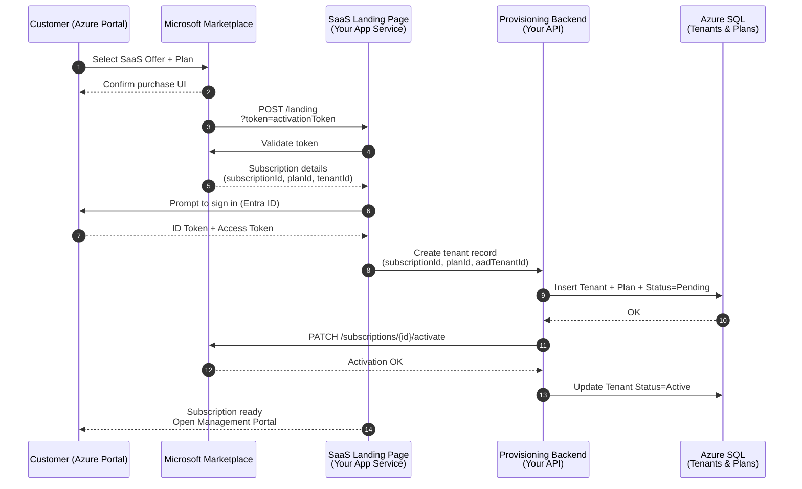

# Microsoft Marketplace Commercial SaaS Provisioning

## What this diagram captures
- Azure Marketplace → Landing Page handshake using the activation token
- Customer authentication via Entra ID
- Backend provisioning of tenant, plan, and limits
- Marketplace activation callback
- Final tenant activation in your SQL database
- Smooth handoff to the management portal

This is the canonical flow Microsoft expects for SaaS offers, and it aligns perfectly with the architecture you’re building.