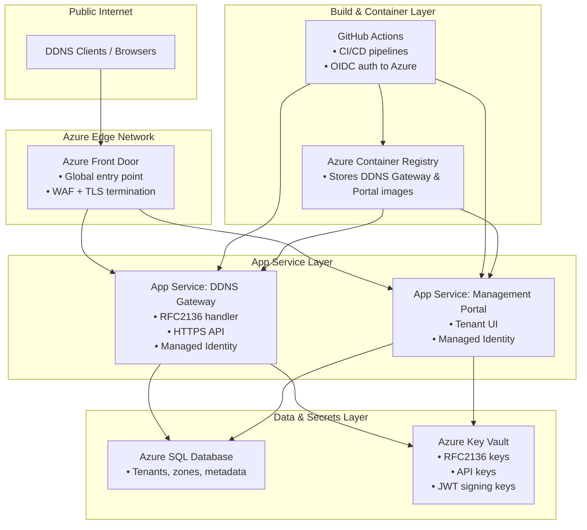

# Deployment Sequence Diagram

## What this diagram highlights
- Azure Front Door is the global, secure entry point for both the DDNS Gateway and the Portal.
- App Service hosts:
   - The DDNS Gateway (RFC 2136, HTTPS API, Azure‑auth)
   - The Management Portal (tenant UI, credential provisioning)
- Both App Services use Managed Identity to securely access:
   - Azure SQL for metadata
   - Key Vault for secrets
- ACR stores container images for both services.
- GitHub Actions builds, pushes, and deploys images using OIDC (no secrets).